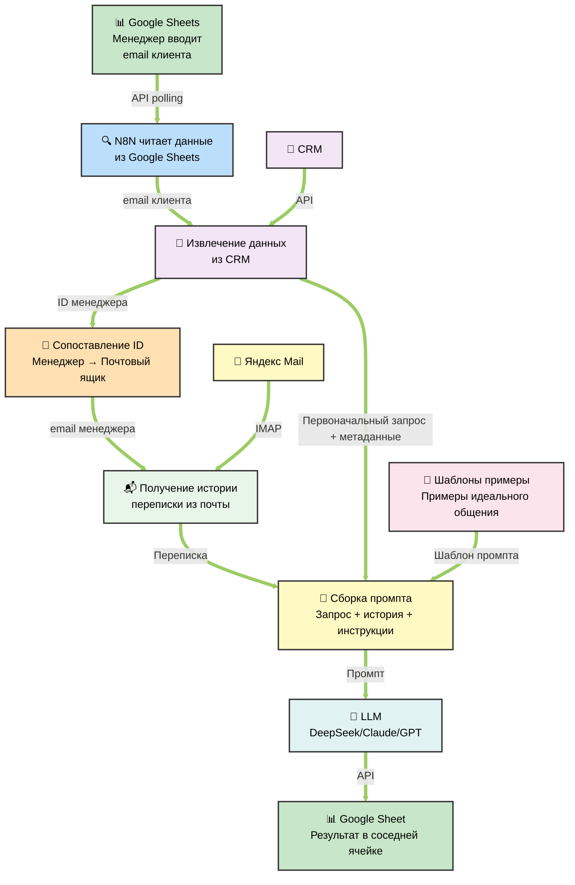

# MovetoRussia Mail Agent — Архитектурная диаграмма N8N Workflow

## Этапы workflow:

| № | Компонент | Описание | Статус |
|---|-----------|---------|--------|
| 1 | **Google Sheets (вход)** | Менеджер вводит письмо клиента | 📋 План |
| 2 | **N8N читает Google Sheets** | Триггер обнаруживает новое письмо и забирает данные | 📋 План |
| 3 | **CRM Lookup** | Поиск первого сообщения от клиента в CRM, получение ID менеджера | 📋 План |
| 4 | **Сопоставление ID → Почта** | По ID менеджера определяется, с какого почтового ящика забирать историю (IMAP) | 📋 План |
| 5 | **IMAP получение истории** | Загрузка полной переписки с клиентом из определённого ящика | 📋 План |
| 6 | **Сборка промпта** | Объединение: текущее письмо + история переписки + шаблоны + инструкции | 📋 План |
| 7 | **LLM генерация** | LLM обрабатывает промпт и генерирует ответ | 📋 План |
| 8 | **Google Sheets (выход)** | Результат записывается в соседнюю ячейку для менеджера | 📋 План |
