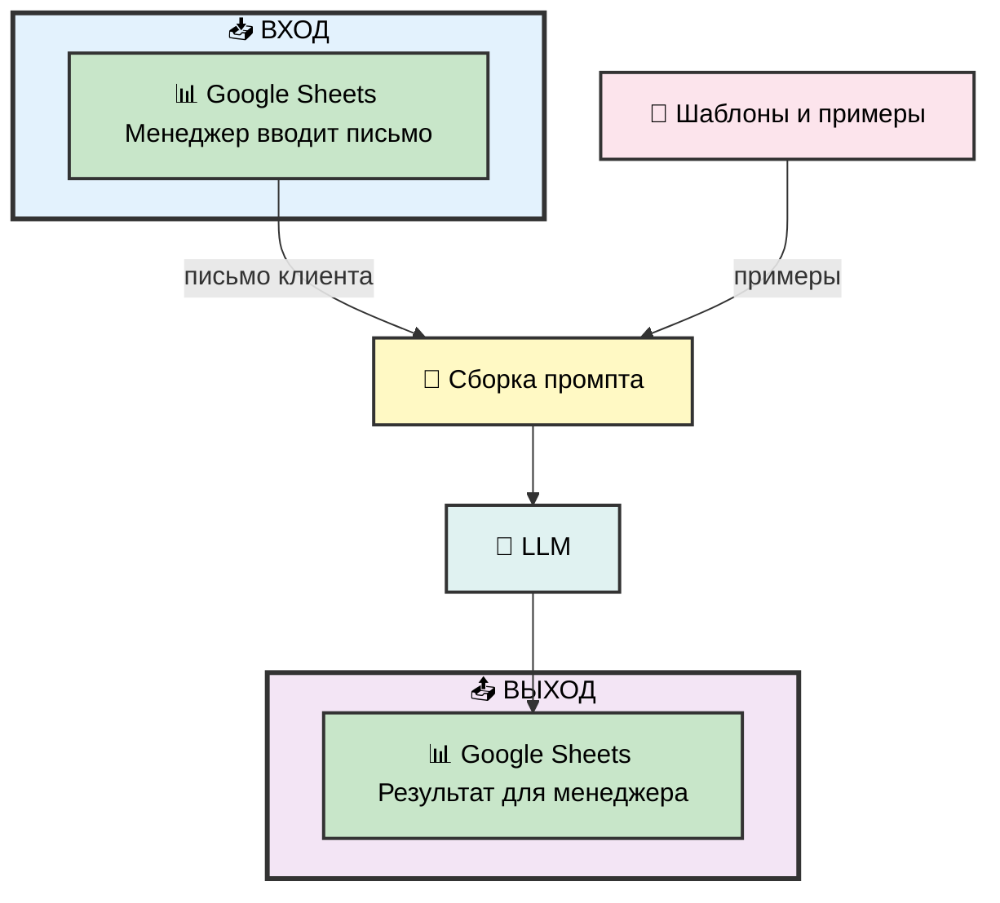

# MovetoRussia Mail Agent — Архитектурная диаграмма

```mermaid
graph TD
    subgraph INPUT[📥 ВХОД]
        A[📊 Google Sheets Менеджер вводит письмо]
    end
    
    B[📝 Шаблоны и примеры]
    
    A -->|письмо клиента| C[🔧 Сборка промпта]
    B -->|примеры| C
    
    C --> D[🤖 LLM]
    
    subgraph OUTPUT[📤 ВЫХОД]
        E[📊 Google Sheets Результат для менеджера]
    end
    
    D --> E
    
    style A fill:#c8e6c9,stroke:#333,stroke-width:2px,color:#000
    style B fill:#fce4ec,stroke:#333,stroke-width:2px,color:#000
    style C fill:#fff9c4,stroke:#333,stroke-width:2px,color:#000
    style D fill:#e0f2f1,stroke:#333,stroke-width:2px,color:#000
    style E fill:#c8e6c9,stroke:#333,stroke-width:2px,color:#000
    style INPUT fill:#e3f2fd,stroke:#333,stroke-width:3px,color:#000
    style OUTPUT fill:#f3e5f5,stroke:#333,stroke-width:3px,color:#000
```
