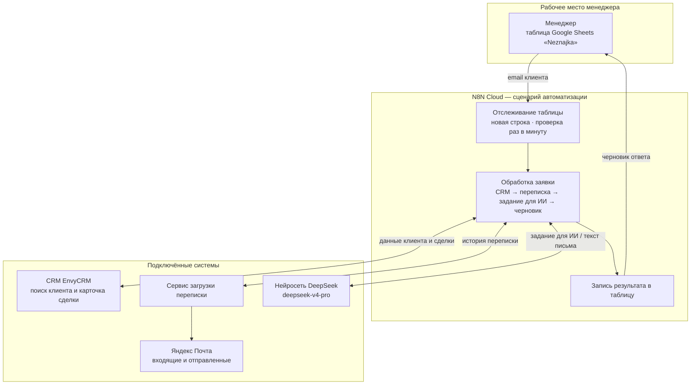

# MovetoRussia Mail Agent — архитектурная схема

> Сгенерировано скриптом `scripts/generate_architecture_diagram.py` из экспорта `Mail Agent.json`.

## Роли компонентов

| Компонент | Что делает | Для кого важно |
|-----------|------------|----------------|
| **Google Sheets «Neznajka»** | Менеджер вводит email клиента и получает черновик ответа, последнее письмо и текст ошибки, если что-то пошло не так. | Менеджер, CEO |
| **N8N Cloud** | Связывает все системы в один сценарий: запуск, сбор данных, подготовка задания для ИИ, запись результата. | Реализация |
| **CRM EnvyCRM** | Находит клиента по email, отдаёт имя, национальность, этап воронки, первое обращение и ID ответственного менеджера. | CEO, менеджер |
| **Сервис загрузки переписки** | По почте менеджера собирает всю переписку с клиентом (входящие и отправленные). | Реализация |
| **DeepSeek** | На основе контекста, правил общения и примеров пишет следующее письмо клиенту на английском. Температура модели: 0.4 (баланс точности и живости текста). | AI-консультант, CEO |
