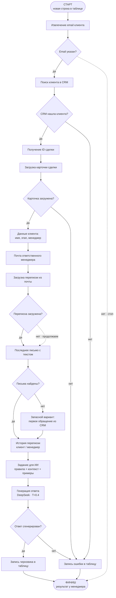

# MovetoRussia Mail Agent — логическая схема

> Сгенерировано скриптом `scripts/generate_logical_diagram.py` из экспорта `Mail Agent.json`.

## Пошаговое описание

| Шаг | Что происходит | Условие / ветвление | Узел N8N (для реализации) |
|-----|----------------|---------------------|---------------------------|
| 1 | Менеджер добавляет строку в таблицу; сценарий проверяет её раз в минуту | — | Google Sheets Trigger |
| 2 | Из последней строки берётся email клиента | Если email пустой — сценарий останавливается | Code in Python |
| 3 | CRM ищет клиента по email | Если CRM недоступна или клиент не найден — ошибка в таблицу | CRM Deal Lookup |
| 4 | Из ответа CRM извлекается ID сделки | Только если шаг 3 успешен | Extract Deal ID |
| 5 | По ID загружается полная карточка сделки | Если ошибка — запись в таблицу | CRM Deal Get |
| 6 | Из карточки берутся имя, национальность, этап воронки, первое обращение, ID менеджера | — | Extract Deal Data |
| 7 | По ID менеджера определяется его рабочая почта | Если ID не в справочнике — подставляется значение по умолчанию | Map Manager Email |
| 8 | Из почты менеджера загружается переписка с клиентом | Если почта недоступна — процесс **не останавливается**, идём дальше без переписки | IMAP Search |
| 9 | Выбирается последнее письмо с непустым текстом | Если писем нет — берётся первое обращение клиента из CRM | extract last mail |
| 10 | Вся переписка собирается в хронологический текст «клиент / менеджер» | — | Format Email History |
| 11 | Формируется задание для ИИ: правила общения, данные клиента, история, 3 эталонных примера | — | Assemble Prompt |
| 12 | DeepSeek генерирует текст следующего письма на английском (temperature 0.4) | Если ошибка — запись в таблицу | Basic LLM Chain |
| 13 | В таблицу записываются черновик ответа, последнее письмо и при необходимости текст ошибки | Успех и сбой оба завершаются у менеджера в таблице | Update Google Sheets |

## Что попадает в таблицу

| Колонка | Что видит менеджер | Откуда берётся |
|---------|-------------------|----------------|
| **client_email** | Email клиента | Из строки, которую добавил менеджер |
| **Neznajka_response** | Черновик ответа клиенту | Сгенерированный текст нейросети |
| **Последнее письмо** | Последнее сообщение в диалоге | Из почты или, если почты нет, из CRM |
| **Техническая информация** | Текст ошибки для разработчика | При сбое CRM, почты или генерации |

## Если что-то пошло не так

| Этап | Что делает система |
|------|-------------------|
| CRM (поиск или карточка) | Останавливает основной путь, пишет ошибку в таблицу |
| Почта | Не останавливает процесс: ИИ работает с данными из CRM |
| Генерация ответа | Пишет ошибку в таблицу, черновик не появляется |
| Сопоставление менеджера | Ошибка не блокирует сценарий (используется значение по умолчанию) |
