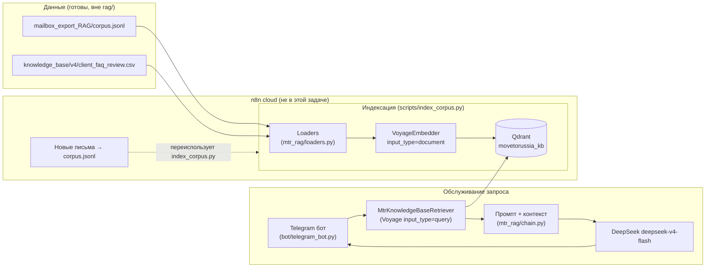

# MoveToRussia RAG Assistant

RAG-ассистент для менеджеров MoveToRussia.com: отвечает в Telegram на вопросы
по прецедентам из переписки с клиентами и по внутреннему FAQ, чтобы разгрузить
CEO от повторяющихся консультаций.

## Архитектура



Индексация и обслуживание запросов — два независимых модуля, связанных только
через коллекцию Qdrant. `scripts/index_corpus.py` не импортирует ничего из
`bot/`, поэтому его легко переиспользовать как шаг n8n-воркфлоу инкрементальной
догрузки писем (n8n workflow сам по себе не создавался — по договорённости).

## Структура

```
rag/
├── mtr_rag/                 # Библиотека (без зависимости на бота)
│   ├── config.py            # Settings из переменных окружения / .env
│   ├── schema.py            # Единая модель Chunk (payload Qdrant)
│   ├── loaders.py           # corpus.jsonl + FAQ CSV → Chunk
│   ├── embeddings.py        # VoyageEmbedder (LangChain Embeddings, retry/backoff)
│   ├── qdrant_store.py      # Коллекция, upsert, фильтры, поиск
│   ├── retriever.py         # Кастомный LangChain BaseRetriever
│   └── chain.py             # Промпт + DeepSeek (LCEL) → ask(question) -> RagAnswer
├── scripts/
│   ├── index_corpus.py      # CLI индексации (--recreate/--dry-run/--batch-size/--limit)
│   └── smoke_test.py        # Индексация + retrieval + генерация на 10-20 chunks
├── bot/
│   └── telegram_bot.py      # aiogram-бот
├── .env.example
└── requirements.txt
```

## Формат данных

**`mailbox_export_RAG/corpus.jsonl`** — по одному JSON-объекту на строку (chunk =
"exchange": вопрос(ы) клиента + ответ(ы) менеджера):

| Поле | Тип | Описание |
|---|---|---|
| `id` | str | Уникальный id chunk'а (`{thread_id}__ex{NNN}`) |
| `thread_id` | str | Id треда (файл в `mailbox_export_RAG/threads/`) |
| `client_email` | str | Email клиента |
| `manager_emails` | list[str] | Email(-ы) менеджера(-ов) в треде |
| `subject` | str | Тема письма |
| `date_start` / `date_end` | str (ISO 8601) | Диапазон дат exchange |
| `language` | str \| null | Язык (если определён) |
| `low_signal` | bool | Малоинформативный обмен (не удаляется, не приоритизируется) |
| `word_count` | int | Число слов в `text` |
| `text` | str | Очищенный текст переписки (`МЕНЕДЖЕР (дата): ...`) |
| `distilled` | str \| null | "Карточка знания" от DeepSeek (если запускали `--distill`) |
| `source` | str | `"mailbox_thread"` |

**FAQ-каталог** — `knowledge_base/v4/client_faq_review.csv` (`;`-разделитель),
колонки: `number;theme;theme_label;frequency;languages;question;question_original;answer;variants`.
Загружается в тот же `Chunk` со `source="faq_catalog"`, текст собирается как
`Q: {question}\nA: {answer}`.

## Переменные окружения (`rag/.env`, см. `.env.example`)

| Переменная | Назначение |
|---|---|
| `VOYAGE_API_KEY` | Ключ Voyage AI |
| `DEEPSEEK_API_KEY` | Ключ DeepSeek |
| `TELEGRAM_BOT_TOKEN` | Токен Telegram-бота |
| `VOYAGE_MODEL` | По умолчанию `voyage-4-large` |
| `VOYAGE_OUTPUT_DIMENSION` | По умолчанию `1024` |
| `VOYAGE_BATCH_SIZE` | Текстов на один embed-запрос, по умолчанию `64` |
| `DEEPSEEK_BASE_URL` | `https://api.deepseek.com` |
| `DEEPSEEK_MODEL` | По умолчанию `deepseek-v4-flash` |
| `DEEPSEEK_TEMPERATURE` | По умолчанию `0.2` |
| `QDRANT_URL` | Например `http://localhost:6333`. Для локального теста без сервера: `path:./_local_qdrant_db` |
| `QDRANT_API_KEY` | Если Qdrant защищён ключом |
| `QDRANT_COLLECTION` | По умолчанию `movetorussia_kb` |
| `MTR_RETRIEVAL_TOP_K` | top-k по умолчанию для retrieval (по умолчанию `6`) |
| `MTR_CORPUS_PATH` / `MTR_FAQ_CSV_PATH` | Переопределить пути к данным (по умолчанию берутся относительно корня репозитория) |

## Запуск

```bash
cd rag
pip install -r requirements.txt
cp .env.example .env   # заполнить реальными ключами

# 1) Индексация (self-hosted Qdrant должен быть доступен по QDRANT_URL)
python scripts/index_corpus.py --dry-run          # оценить кол-во токенов/стоимость
python scripts/index_corpus.py --recreate          # первая полная индексация
python scripts/index_corpus.py                     # инкрементальный re-run (upsert по chunk id)

# 2) Быстрая проверка пайплайна на небольшой выборке (свой локальный Qdrant on-disk, без сервера)
python scripts/smoke_test.py

# 3) Telegram-бот
python bot/telegram_bot.py
```

### Флаги `scripts/index_corpus.py`

- `--recreate` — пересоздать коллекцию Qdrant с нуля.
- `--batch-size N` — размер батча для Voyage (учитывает лимит ~128 текстов/запрос).
- `--dry-run` — только считает токены (через локальный токенизатор Voyage) и
  оценивает стоимость, ничего не пишет в Qdrant и не делает embed-вызовов.
- `--no-faq` — индексировать только mailbox-корпус, без FAQ-каталога.
- `--limit N` — индексировать только первые N chunks (для смоук-тестов).

## Retrieval + генерация

`mtr_rag/chain.ask(question, top_k=..., source=..., exclude_low_signal=..., manager_email=...)`:

1. Эмбеддинг вопроса менеджера через Voyage (`input_type="query"`).
2. Top-k поиск в Qdrant (по умолчанию top_k=6, настраивается).
3. Контекст собирается с явным указанием `thread_id` / `subject` / даты у
   каждого найденного фрагмента.
4. DeepSeek (`deepseek-v4-flash`) отвечает по системному промпту, который явно
   требует не выдумывать факты и явно сообщать о недостаточности контекста.
5. Возвращается `RagAnswer(answer, sources)` — ответ и список источников.

`low_signal` chunks не исключаются из индекса и не фильтруются по умолчанию —
только опционально через `exclude_low_signal=True` (использует Qdrant `must_not`
фильтр по полю `low_signal`).

## Известное ограничение тестовой среды

В песочнице, где собирался этот пайплайн, исходящие запросы к
`api.voyageai.com` блокировались на сетевом уровне (HTTP 403 без тела от
самого Voyage — похоже на гео-блок/сетевой фильтр, а не на проблему с ключом).
DeepSeek и HuggingFace (используется Voyage SDK для локальной токенизации в
`--dry-run`) были доступны без проблем.

Поэтому `scripts/smoke_test.py` поддерживает флаг `--fake-embeddings`
(детерминированный hash-эмбеддер вместо Voyage) — так проверены Qdrant
storage/retrieval и DeepSeek-генерация целиком, но **не** качество реального
семантического поиска Voyage. Перед вводом в эксплуатацию нужно прогнать
`python scripts/smoke_test.py` (без флага) в сети, где Voyage API доступен, и
убедиться, что ответы/источники релевантны.

## Документация для полного воспроизведения проекта

Подробные инструкции (поднять с нуля, пайплайн данных, архитектура, Qdrant,
CI/CD, поддержка, стоимость, доступы) — в [`docs/`](docs/README.md).

## Что осталось на усмотрение пользователя

- Тонкая настройка `top_k` (сейчас 6, разумный диапазон 5-8 из задачи).
- Порог/логика приоритизации `low_signal` chunks при retrieval (сейчас — просто
  не исключаются и не бустятся).
- Формулировка системного промпта — сейчас нацелен на "не выдумывать факты" и
  указание источников; можно уточнять тон под стиль компании.
- Выбор конкретного FAQ CSV-файла: используется `client_faq_review.csv`
  (224 отревьюированные группы вопросов). Есть также `client_faq_frequent.csv`
  (только frequency≥2) и `client_faq_quality_once.csv` — при необходимости
  переключить через `MTR_FAQ_CSV_PATH`.
- Реальный прогон `index_corpus.py` и `smoke_test.py` (без `--fake-embeddings`)
  против рабочего Voyage API и self-hosted Qdrant.
- Встраивание `index_corpus.py` в n8n cloud как шаг инкрементальной догрузки.
